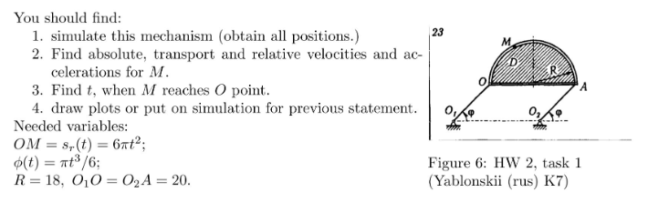

# Homework 2

**Author:** Igor Alentev

**Telegram:** [m8dotpie](https://t.me/m8dotpie)

**Email:** i.alentev@innopolis.university

## Stack:

The work is done within the single Jupyter Notebook. All the simulations were printed directly to the gif files. To replicate the result you should execute the [notebook](TMHW2.ipynb) and check generated files called "task1.gif" and "task2.gif".

This is the first homework when I finally started using custom class for simple and fast plotting.

- Python Notebooks
- python3
- numpy
- sympy
- ipympl
- matplotlib

## Table of Contents:
- [x] [Task 1](#task-1)
   - [Solution](#1.s)
   - [Visual Simulation](#1.si)
- [x] [Task 2](#task-2)
   - [Solution](#2.s)
   - [Visual Simulation](#2.si)

# Task 1

## Solution 

## Geometrical intuition

This time the task does not contain any difficult steps in producing the simulation. Sinse $O_1O_2AO$ is parallelogram we can easilly find coordinates of all points. Given that $O_1$ is the origin, we know that $O_2$ is $2R$ on axis $x$. We know that $O$ is rotating around the origin, therefore $A$ is $O$ translated on $x$ axis by $2R$. $M$ is rotating on circumference of the semicircle with origin at $\frac{O + A}{2}$ with the known law of arc length.

## Mechanical intuition

We can split the task on the two parts.

### First part

Point $M$ did not reach point $A$. Then we can easilly calculate relative, transport velocity, relative, corealis and transport accelerations. During my simulation I have taken point $O_s = \frac{O + A}{2}$ as a pole for $M$. It is beneficial since we know that $O_s$ is rotating with the same angle law as the $O$ and $A$ and it is the only motion. Moreover, the distance $O_sM$ is simply the radius $R$. We can easilly derive $\omega_1, \epsilon_1$ from $\phi(t)$ and $\omega_2, \epsilon_2$ from $s_r(t)$, therefore:

$$
\vec{V}_{O_s} = \vec{\omega}_1 \times \frac{\vec{O}_1 + \vec{O}_2}{2}
$$

$$
\vec{V}_M^{tr} = \vec{V}_{O_s} + \vec{\omega}_1 \times (\vec{M} - \vec{O}_s)
$$

$$
V_M^{rel} = 
$$

$$
a_M^{tr} = 
$$

$$
a_M^{cor} = 
$$

$$
a_M^{rel} = 
$$

## Visual Simulation 

# Task 2

## Solution 

## Visual Simulation 