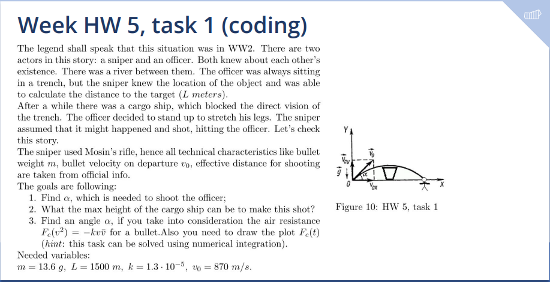
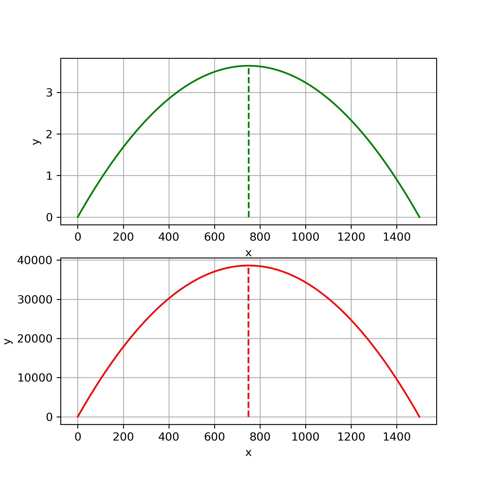
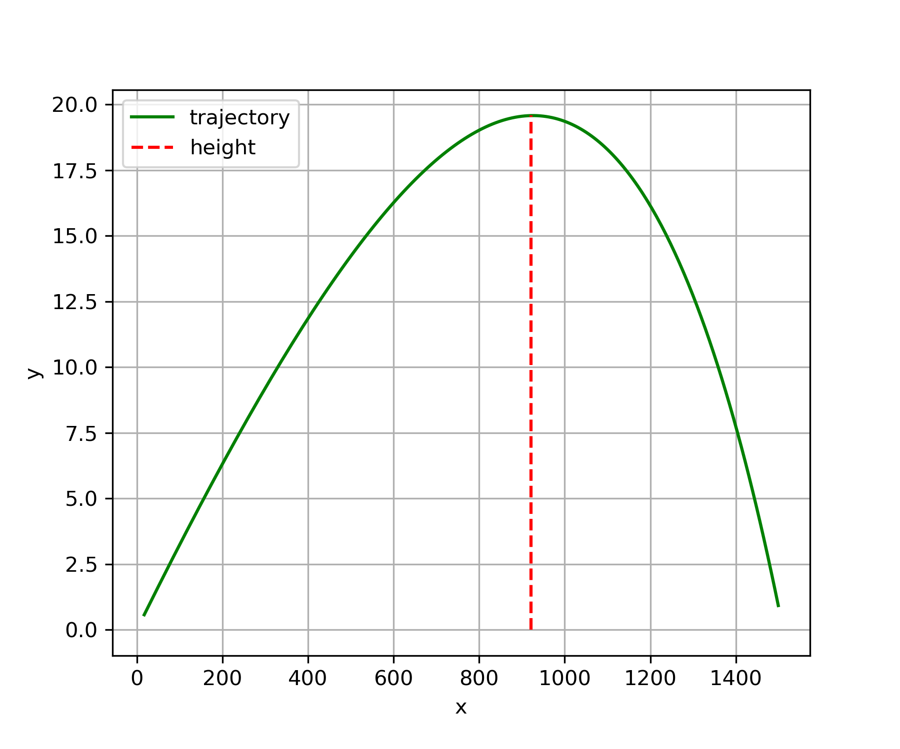
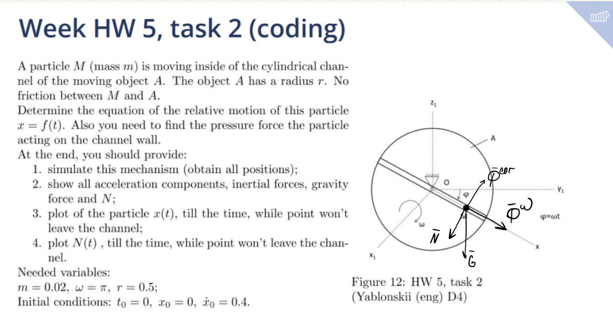
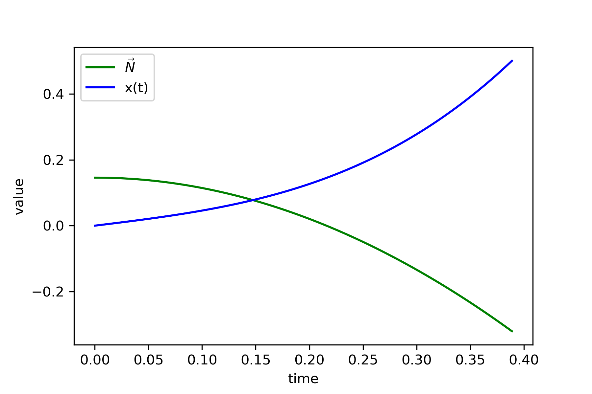

# Homework 3

**Author:** Igor Alentev

**Telegram:** [m8dotpie](https://t.me/m8dotpie)

**Email:** i.alentev@innopolis.university

## Table of Contents
- [x] [Task 1](#task-1)
  - [Research Object](#1.ro) 
  - [Solution Method](#1.me)
  - [Force Analysis](#1.fa)
  - [Solution](#1.so)
    - [1.1 + 1.2](#1.12)
    - [1.3](#1.3)
- [x] [Task 2](#task-2)
  - [Research Object](#2.ro) 
  - [Solution Method](#2.me)
  - [Force Analysis](#2.fa)
  - [Solution](#2.so)
    - [Finding Reaction](#2.fr)
    - [Plotting Reaction](#2.pr)
    - [Simulating System](#2.ss)
- [x] [Task 3](#task-3)
  - [Research Object](#3.ro) 
  - [Solution Method](#3.me)
  - [Force Analysis](#3.fa)
  - [Solution](#3.so)
  - [Answer](#3.a)

# Task 1

## Research Object: 
A bullet which can be considered as a material point.

## Method: 
Differential representation of a Newton's law

## Force analysis: 

$$\vec{G} = m\vec{g}$$

## Solution 

### 1.1 + 1.2 

Both these points are quite simple to solve. We have to write differential equations for acceleration, velocity and position through first and second order derivatives of the position. Moreover, since we know initial conditions and there is no any other forces, equations are relatively simple.

First integration constant is mass by velocity projection on the axis. The second constant is zero. As a result, we have the following equations:

$$m\ddot{x} = 0$$

$$m\dot{x} = mv_0\cos{\alpha}$$

$$mx = mv_0\cos{\alpha} \cdot t$$

And for $\ddot{y}$ we have the very same situation with constants and the following final equations:

$$m\ddot{y} = -mg$$

$$m\dot{y} = -mgt + mv_0\sin{\alpha}$$

$$my = -\frac{1}{2}mgt^2 + mv_0\sin{\alpha} \cdot t$$

To find $\alpha$ we can solve the system of equations for $my$ and $mx$, since we know final conditions (final point is $(L, 0)$). The system of two unknows and two equations and we can find both angle and time. Knowing time and equations for velocity, we can find the vertex of this parabola as the point when $\dot{y}$ is zero with the known angle. Finally, we get the following results:

$$t_1 = 1.7, \alpha_1 = 9.7 \cdot 10^{-3}, h_1 = 3.641841663376591$$

$$t_2 = 177.54, \alpha_2 = 1.56, h_2 = 38613.70509711211$$

And the plots for both situations:

### 1.3 

This task is a bit harder, since air resistance does not allow us to apply simple integration to find all the necessary values. We have to apply numerical integration here. First of all let's get the equations:

$$\frac{d^2x}{dt^2} = \frac{-k}{m} \dot{x}\sqrt{\dot{x}^2 + \dot{y}^2} $$

$$\frac{d^2y}{dt^2} = \frac{-k}{m} \dot{y}\sqrt{\dot{x}^2 + \dot{y}^2} - g$$

These equations follow from the laws for $\ddot{x}$ and $\ddot{y}$. All what is left is to numerically calculate this system of equations. The only issue is that we do not have initial conditions for projections of the velocity on the axes.

This problem can be solved by bruteforcing the angle and checking whether we hit the necessary point with the given angle. Using this approach we find the following configuration:

$$t = 3.84, \alpha = 0.033, h = 19.58$$

And the graph as follows:

# Task 2

## Research Object: 
A material point in a channel (one degree of freedom) on a rotating body.

## Method: 
Differential representation of a Newton's law

## Force analysis: 

$$\vec{\Phi^{\omega}}, \vec{\Phi^{cor}}, \vec{N}, \vec{G}$$

We can omit $\vec{\Phi^{\epsilon}}$ since our body does not have angular acceleration. As a result, our $\vec{\Phi^{tr}}$ converges to the single component. 

## Solution 

$$m\vec{a^{rel}} = \vec{\Phi^{\omega}} + \vec{\Phi^{cor}} + \vec{N} + \vec{G}$$

Let's use the axis $x$ given by the problem statement and direct $y$ such that $\omega$ is clockwise. Let's choose the direction of $N$ arbitrary so we will determine it from the equations. Knowing that $\alpha = \omega t$ and considering projections we get:

$$OM = x = x(t)$$

$$V^{rel}_M = \dot{x}$$

$$\Phi^{\omega} = \omega^2 x$$

$$m\ddot{x} = m\omega^2x + mg\sin{\omega t}$$

$$m\ddot{y} = m\omega \dot{x} - mg\cos{\omega t} + N$$

Solving the first differential equations we get:

i.e.

$$x(t) = 0.312 \exp{-\pi t} + 0.312 \exp{\pi t} - 0.497\sin{\pi t} $$

## Finding Reaction 

Knowing the law of relative motion, we can find $V^{rel} = \dot{x}$ and we can find Coriolis acceleration. Since we know that $m\ddot{y}=0$ we can express the $N$ from the initial equation:

$$N = g\omega t - m \omega \dot{x}$$

Substituting $\dot{x}$ yields the $N$ as the function of time. 

Given that we know the law of motion, we can calculate the moment when the $M$ will leave the body:

i.e. $t = 0.388943$

## Plotting Reaction 

Simulating the system with all the known quantities we obtain the following plots for normal reaction and $x(t)$:

## Simulating system 

And the following system simulation:

# Task 3

`Additional statement: Mass of the ABCD body is M = 100kg.`

## Research Object: 
System of 4 bodies and 2 pulleys with an ideal string.

## Method: 
Mass geometry and Center of mass analysis.

## Force analysis: 

$P_1, P_2, P_3$ - weights of bodies attached to the string.

$N$ - reaction of the floor

$P$ - weight of the $ABCD$ body

## Solution: 

$$m \vec{a} = \sum{\vec{F}} = \vec{P_1} + \vec{P_2} + \vec{P_3} + \vec{P} + \vec{N}$$

$$m\ddot{x_c} = 0$$

$$m\dot{x_c} = C_0 = 0 \Rightarrow C_0 = 0$$

$$mx_c = C_1 = 0 \Rightarrow C_1 = 0$$

Therefore, center of mass displacement is zero, then we can apply the analysis of center of mass.

|     | Initial | Final |
|-----|---------|-------|
| $x_{c_1}$ | 0       |  $x_{c_1} - \Delta{S}$ |
| $x_{c_2}$ | 0       |  $x_{c_2} - \Delta{S} + \Delta{x_{c_2}}$ |

Where $\Delta{x_{c_2}}$ is the displacement of the center of mass of the system of bodies $1, 2, 3$ relative to the object $ABCD$.

Let's fix the body $ABCD$ in place and calculate the displacement of the center of mass of the bodies $1, 2, 3$ realtive to it.

$$x_{c_2} = \frac{M_1x_1 + M_2x_2 + M_3x_3}{M_1 + M_2 + M_3}$$

$$x_{c_2} + \Delta{x_{c_2}} = \frac{M_1x_1 + M_2(x_2 + 1) + M_3(x_3 + \cos{60})}{M_1 + M_2 + M_3}$$

$$\Rightarrow \Delta{x_{c_2}} = \frac{M_2 + M_3\cos{60}}{M_1 + M_2 + M_3}$$

Finally, we can write analysis of the center of mass of the whole system. Let $M_1 + M_2 + M_3 = m_2$ and the mass of $ABCD$ be $m_1$, then:

$$x_c = \frac{m_1x_1 + m_2x_2}{m_1 + m_2} = \frac{m_1(x_1 - \Delta{S}) + m_2(x_2 - \Delta{S} + \Delta{x_{c_2}})}{m_1 + m_2}$$

$$\Delta{S} = \frac{m_2\Delta{x_{c_2}}}{m_1 + m_2}$$

## Answer 

$$\Delta{S} = 0.137m \approx 14cm$$

Since we guessed the right sign of the movement, we can conclude that the final displacement of the system was $14cm$ to the left.

