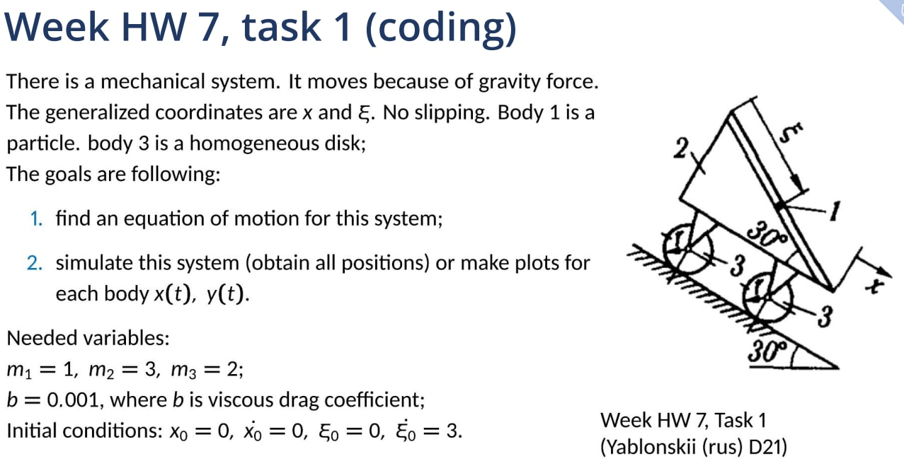
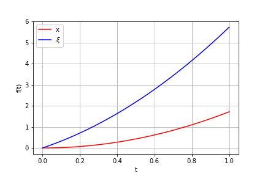

# Homework 7

**Author:** Igor Alentev

**Telegram:** [m8dotpie](https://t.me/m8dotpie)

**Email:** i.alentev@innopolis.university

## Table of Contents

- [Homework 7](#homework-7)
  - [Table of Contents](#table-of-contents)
  - [Research object](#research-object)
  - [Method](#method)
  - [Force analysis](#force-analysis)
  - [Solution](#solution)
    - [Final system](#final-system)
    - [Laws of motion](#laws-of-motion)
    - [Laws of motion graph](#laws-of-motion-graph)
    - [System simulation](#system-simulation)

$$q_1=x, q_2=\xi$$

## Research object

A system of four bodies. A cart, two wheels and a material point on the hypotenuse.

## Method

Analytical mechancics - generalized forces, kinematic and potential energy and lagrange equation.

## Force analysis

We don't consider connections reactions, since we assume connections to be ideal. Moreover, I will consider genralized non-potential forces. I.e. I will find $Q_x^n$ through Lagrangian function, as a result, I don't have to consider potential forces at all.

$$P_1, P_2, P_3, Q_x, Q_{\xi}, R$$

If we fix $q_2$, the only non-potential force acting on the system with virtual displacement $\delta q_1$ will be viscous drag. Therefore:

$$Q_x = \frac{R\delta x}{\delta q_1} = \frac{R\delta x}{\delta x} = R$$

If we fix $q_1$, there will be no non-potential forces acting on the body and as a result, no work by non-potential forces was done.

$$Q_{\xi} = 0$$

## Solution

Now to calculate $Q_x$ and $Q_{\xi}$ the other way, we have to find potential and kinetic energy of the system. Given that the zero-point for the potential energy is the inital state of the system, we can calculate the potential energy through the motion laws. More precisely:

$$\Pi_1 = -P_1(x\sin{30} + \xi\sin{60})$$

$$\Pi_2 = -P_2(x\sin{30})$$

$$\Pi_3 = -P_3(x\sin{30})$$

$$\Pi_{total} = \Pi_1 + \Pi_2 + 2 \cdot \Pi_3 = -(P_1 + P_2 + 2P_3)x\sin{30} - P_1 \xi\sin{60}$$

Kinetic energy can be calculated pretty straightforward:

$$T_1 = \frac{1}{2}m_1V^2_1 = \frac{1}{2}m_1((\dot{x} + \dot{\xi}\cos{30})^2 + (0 + \dot{\xi}\sin{30})^2)$$

$$\Rightarrow T_1 = \frac{1}{2}m_1(\dot{x}^2 + \dot{\xi}^2 + 2\dot{x}\dot{\xi}\cos{30})$$

$$T_2 = \frac{1}{2}m_2V^2_1 = \frac{1}{2}m_2\dot{x}^2$$

$$T_3 = \frac{1}{2}m_1V^2_1 + \frac{1}{2}J\omega^2 = \frac{1}{2}m_3\dot{x}^2 + \frac{1}{4}m_3r^2\left(\frac{\dot{x}}{r}\right)^2 = \frac{3}{4}m_3\dot{x}^2$$

$$T_{total} = T_1 + T_2 + 2\cdot T_3 = \frac{1}{2}m_1(\dot{x}^2 + \dot{\xi}^2 + 2\dot{x}\dot{\xi}\cos{30}) + (\frac{1}{2}m_2 + \frac{3}{2}m_3)\dot{x}^2$$

As a result, let's denote:

$$L = T - P = \frac{1}{2}m_1(\dot{x}^2 + \dot{\xi}^2 + 2\dot{x}\dot{\xi}\cos{30}) + (\frac{1}{2}m_2 + \frac{3}{2}m_3)\dot{x}^2 + (P_1 + P_2 + 2P_3)x\sin{30} + P_1 \xi\sin{60}$$

$$\frac{d}{dt}\frac{\partial L}{\partial \dot{x}} - \frac{\partial L}{\partial x} = Q_x$$

$$\frac{d}{dt}\frac{\partial L}{\partial \dot{\xi}} - \frac{\partial L}{\partial \xi} = Q_{\xi}$$

$$\frac{d}{dt}\frac{\partial L}{\partial \dot{x}} = m_1\ddot{x} + m_1\ddot{\xi}\cos{30} + 2(\frac{1}{2}m_2 + \frac{3}{2}m_3)\ddot{x}$$

$$\frac{\partial L}{\partial x} = (P_1 + P_2 + 2P_3)\sin{30}$$

$$\frac{d}{dt}\frac{\partial L}{\partial \dot{\xi}} = m_1\ddot{\xi} + m_1\ddot{x}\cos{30}$$

$$\frac{\partial L}{\partial \xi} = P_1\sin60$$

$$\Rightarrow Q_x = m_1\ddot{x} + m_1\ddot{\xi}\cos{30} + 2(\frac{1}{2}m_2 + \frac{3}{2}m_3)\ddot{x} - (P_1 + P_2 + 2P_3)\sin{30} = -R$$

$$\Rightarrow Q_{\xi} = m_1\ddot{\xi} + m_1\ddot{x}\cos{30} - P_1\sin{60} = 0$$

### Final system

$$\Rightarrow 
\left[\begin{array}{c}
0\\
0\end{array}\right]
=\left[\begin{array}{c c}
m_1 + 2m_2 + 1.5m_3 & m_1\cos{30}\\
m_1\cos{30} & m_1
\end{array}\right]
\left[\begin{array}{c}
\ddot{x}\\
\ddot{\xi}\end{array}\right]
+
\left[\begin{array}{c}
- (P_1 + P_2 + 2P_3)\sin{30} + R\\
-P_1\sin{60}\end{array}\right]
$$

### Laws of motion

From this system we can easilly find the laws of motion. For example, we can find them the following way:

### Laws of motion graph

Graph of behaviour of laws of motion is as the following:

### System simulation

Finally, knowing the laws of motion, we can simulate our system:

