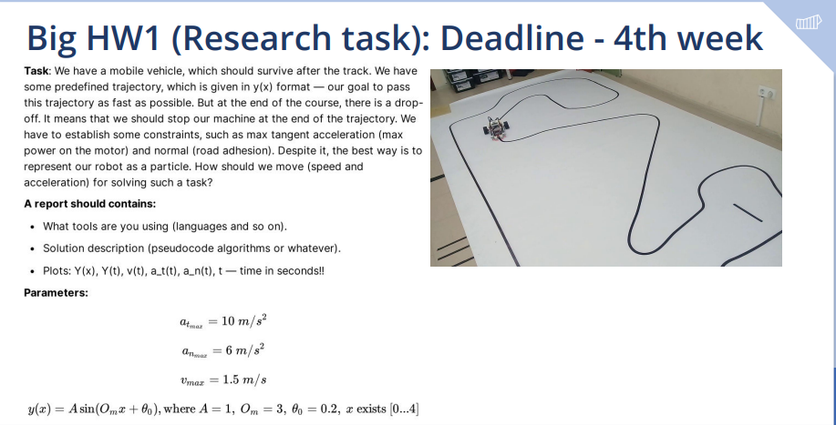
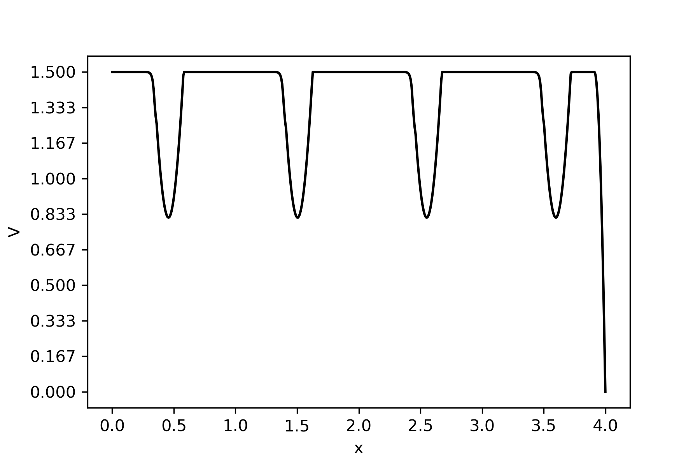
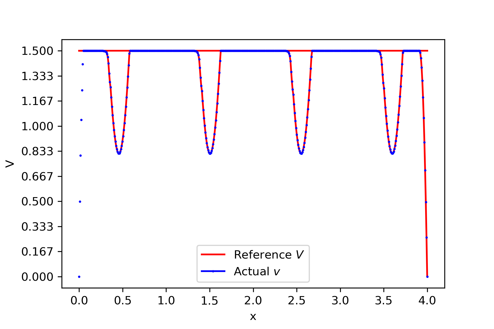
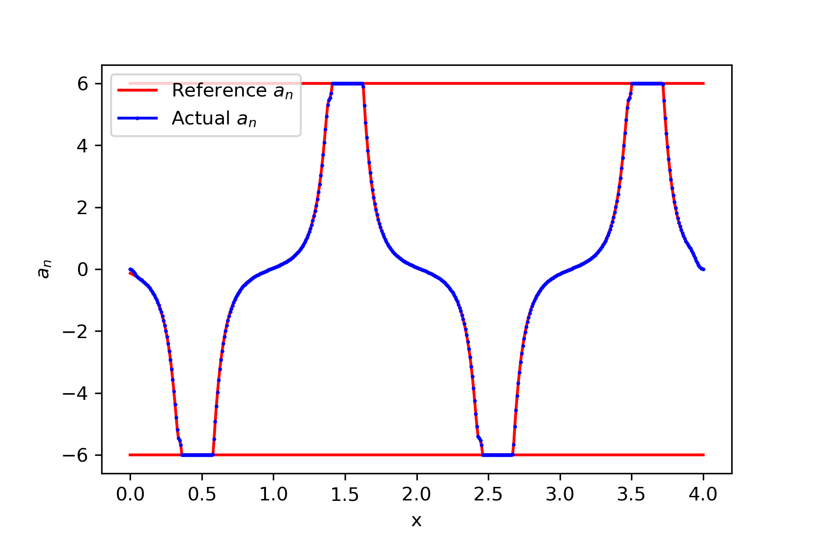
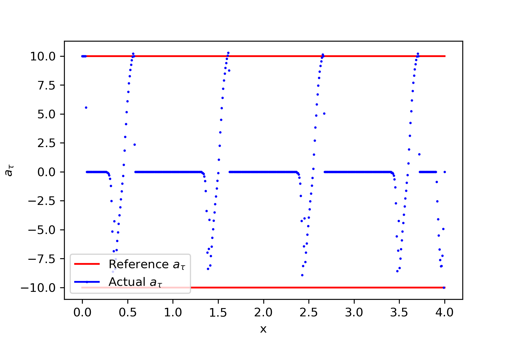
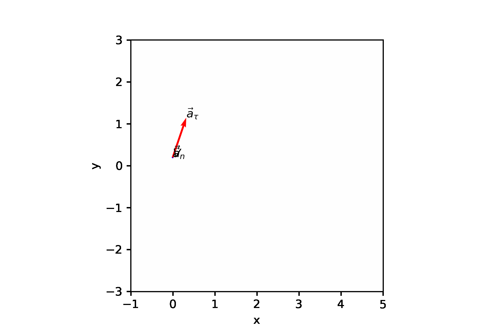

# Research Homework 1

**Author:** Igor Alentev

**Telegram:** [m8dotpie](https://t.me/m8dotpie)

**Email:** i.alentev@innopolis.university

## Stack:

The work is done within the single Jupyter Notebook. All the simulations were printed directly to the gif files. To replicate the result you should execute the [notebook](TMHW2.ipynb) and check generated files called "task1.gif" and "task2.gif".

This is the first homework when I finally started using custom class for simple and fast plotting.

- Python Notebooks
- python3
- numpy
- sympy
- ipympl
- matplotlib

## Table of Contents:
- [x] [Task](#task)

# Task

# Solution

## The main idea

Firstly I will divide the whole path into several segments using simple linspacing. In my particular case I used the split onto $1000$ parts. Then we calculate $y_i$ for each $x_i$ in split. Moreover, we will approximate the arc length as the sum of line segments $\sigma_i = \sum_{j=0}^{i - 1} \|[x_{i + 1}, y_{y + 1}] - [x_{i}, y_{y}]\|$

I will use some ideas from dynamic programming to dynamically optimize velocities and accelerations in the given constraints in each of the path segments. Given $[x_i, y_i]$ and $[x_{i + 1}, y_{i + 1}]$ - the beginning and the end of the current segment, we will dynamically estimate $v_i, a_i$ - velocity and acceleration of the car on the given segment based on the values from the previous step.

## Reference Velocity

First of all we have to estimate the limit values of velocities on each segment of the path. Since we have constraints $v_{max}, a_{n_{max}}$ and $a_{\tau_{max}}$. 

Also we have to consider slowing down before finish. We can tweak this with special parameter describing how many segments we will slow down before the end of the track.

As the slowing down algorithm I will use quadratic decceleraion. This will help to preserve the maximum possible speed for as long as possible. 

 After some basic calculations we get the following graph:

The main  trick is that I will use limit velocities as a reference for the dynamic calculation. Let's call reference velocity at the point $[x_i, y_i]$ as $V_i$ and actual velocity as $v_i$. There are several assumptions:

1. Given we know the $v_i$, we can calculate the time needed to travel from $\sigma_i$ to $\sigma_{i + 1}$ and we will call this time as $dt_i$

2. If it is needed to accelerate, our tangential acceleration is enough to accelerate from $v_i$ to $V_{i + 1}$. **(we will return to this later)**

3. If we have too much time for acceleration, then we will reach target velocity $V_i$ and **stop accelerating**. (either accelerate for some time with $a_{{\tau}_{max}}$ or accelerate all avaiable time with some $a_i < a_{{\tau}_{max}}$, the result will be the same)

On practice second assumption is wrong. Our tangential acceleration constraint limits our acceleration quite hard. To overcome this issue we will use some empirical **polishing**. After first algorithm test we will check which segments lack acceleration or decceleration. In the first case we will slightly lower reference speeds $V_i$. If we lack decceleration we will lower reference velocities in advance to start deccelerating a bit earlier.

There are many ways to perform such a polishing, but I will use the one described below:

Given that at point $[x_i, y_i]$ there is no enough decceleration to dive below speed limit. Let's take the interval $[x_{i - a}, y_{i + b}]$. This interval should satisfy the requirement that the reference speed is non-strictly decreasing on the whole interval. As a result, we can perform the following:

$$V_i = \frac{V_i + V_{i + 1}}{2}$$

For all $i$ in the right-open interval. However, this operation should be done in right to left direction. As a result, we will average the velocities on the whole interval, making the difference between adjacent elements lower. Moreover, our velocities will **only decrease**. As a result, we will not violate any of the constraints.

## Actual Velocity

Let's calculate velocities dynamically from left to right using the calculations of the previous steps. There are three cases we have to consider:

1. $v_i < V_{i + 1}$ - we need to accelerate

Given we already done all the polishing of reference velocities, we can simply reach the target velocity. $v_{i + 1} = V_{i + 1}$ and $dt_i = t_1 + t_2$ where  $t_1$ is the time needed to reach $V_{i + 1}$ and $t_2$ is the time needed to travel the distance to the next segment left after acceleration (if any).

2. $v_i = V_{i + 1}$ - no need to change velocity

Simple as $v_{i + 1} = v_{i}$ and $dt_i$ equals the time needed to travel the given arc $\sigma_{i + 1} - \sigma_i$.

3. $v_i > V_{i + 1}$ - we need to decelerate

With all the previous polishing it is in the same manner $v_i = V_{i + 1}$ and $dt_i = t_1 + t_2$ where $t_1$ time needed to deccelerate and $t_2$ time needed to travel arc left.

## Velocity Result Analysis

You can see the final velocities generated by dynamic programming on the following plot.

We can easilly validate that all the velocities stay in the given velocity and acceleration boundaries. To be sure we can verify accelerations sepately.

### Normal Acceleration

As we can see, normal accelration is clearly within boundaries. Maximum normal acceleration was calculated not only as $[-a_{n_{max}}, a_{n_{max}}]$, but as the reference velocity squared divided by curvature.

### Tangential Acceleration

As we can see, tangential acceleration calculated from actual velocities and $dt$ is perfectly fine with only slight anomalies on peaks of acceleration which can be easilly smoothed by further fine-tuning of polishing. I did not consider these anomalies as a big deal, since there are only 1-2 anomalies per peak with the deviation of around $0.1$.

# Conclusion and Results

To get the result we have to simply sum up the time on all segments $\sum_{i=0}^n dt_i$. This implies the following result:
$$t = 6.1163\;sec$$

The simulation itself looks like this:

